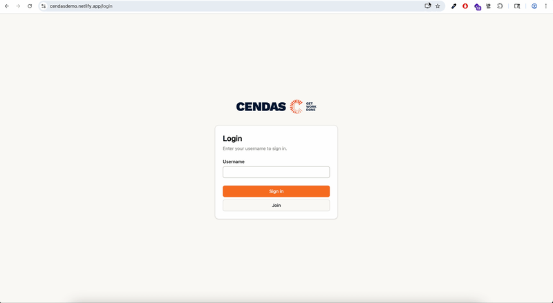
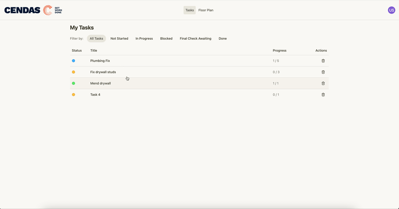
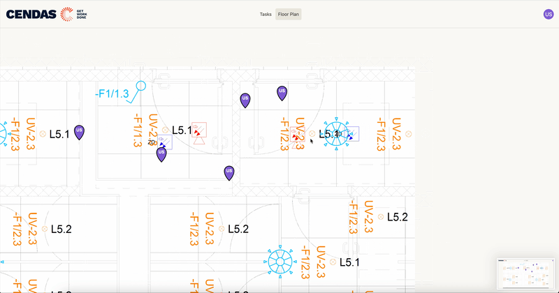

# Cendas Frontend Developer Code Example

Welcome to the Cendas demo codebase!

✅ Installable

✅ Task Management

✅ Mobile-friendly Interactivity

## Demo Video

Demo Video was passed along via email.

## Tasks

- ✅ State Management - 2 days
- ✅ Floor Plan Page - 1.5 days
- ✅ Task List Page - 4 hrs
- ✅ Offline (PWA) Support - 4 hrs
- ✅ UX Enhancements - 4 hrs

## Instructions

### Running the application

Deployment link: https://cendasdemo.netlify.app/

### Local Development Setup

1. Install dependencies: `npm i`
2. `npm run dev`
3. Navigate to http://localhost:5173/ in the browser

## Refactor Opportunities

- UX Improvements:
  - Kanban board view for tasks
  - Pagination
  - Task filtering on floor plan page
  - Direct navigation from task to its marker on floor plan
  - Collaboration features
- Code Improvements
  - Slices / Shallow checking in state management
  - Testing
